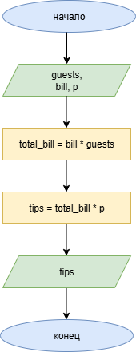

# Домашнее задание к работе 2

## Условие задачи
Четыре человека пообедали в ресторане. Официант подал им счет на Х руб. каждому.
Они решают оставить официанту чаевые в размере 15% от счета. Составьте программу,
которая выведет на экран сумму чаевых, которую получил официант.

## 1. Алгоритм и блок-схема

### Алгоритм
1. **Начало**
2. Объявить константы:
   - 'p' = 0.15 - процент, который чаевые составляют от счёта
   - 'guests' = 4 - количество гостей
3. Задать исходные данные:
   - `bill` = 1000 — счёт каждого гостя
4. Вычислить общий счёт:
   - 'total_bill' = 'guests' * 'bill'
5. Вычислить сумму чаевых:
   - 'tips' = 'total_bill' * 'p'
6. Вывести результаты расчетов с подстановкой всех значений в текст.
7. **Конец**

### Блок-схема

## 2. Реализация программы

int main()

{

	const float p = 0.15;
	int x = 1000;
	int n = 4;

	setlocale(LC_CTYPE, "RUS");

	int pp = p * 100;
	int bill = x;
	int guests = n;
	int total_bill = guests * bill;
	int tips = total_bill * p;

	printf("РАСЧЁТ СУММЫ ЧАЕВЫХ\n");
	printf("-------------------\n\n");
	printf("УСЛОВИЯ:\n");
	printf("- Количество гостей за столом - %d человека.\n", guests);
	printf("- Официант подал им счёт на 1000 руб. каждому.\n");
	printf("- Гости решают оставить чаевые официанту в размере %d процентов от счёта.\n\n", pp);
	printf("РАСЧЁТ:\n");
	printf("- Общий счёт стола равен сумме счетов всех гостей = %d * %d = %d руб.\n", bill, guests, total_bill);
	printf("- Сумма чаевых составляет 15 процентов от общего счёта = %d * %0.2f = %d руб.\n\n", total_bill, p, tips);
	printf("ОТВЕТ:\n");
	printf("%d руб.\n\n", tips);

	return 0;

}

## 3. Результаты работы программы

РАСЧЁТ СУММЫ ЧАЕВЫХ
-------------------

УСЛОВИЯ:
- Количество гостей за столом - 4 человека.
- Официант подал им счёт на 1000 руб. каждому.
- Гости решают оставить чаевые официанту в размере 15 процентов от счёта.

РАСЧЁТ:
- Общий счёт стола равен сумме счетов всех гостей = 1000 * 4 = 4000 руб.
- Сумма чаевых составляет 15 процентов от общего счёта = 4000 * 0.15 = 600 руб.

ОТВЕТ:
600 руб.

## 4. Информация о разработчике

Вильальба Агния, бТИИ-251
